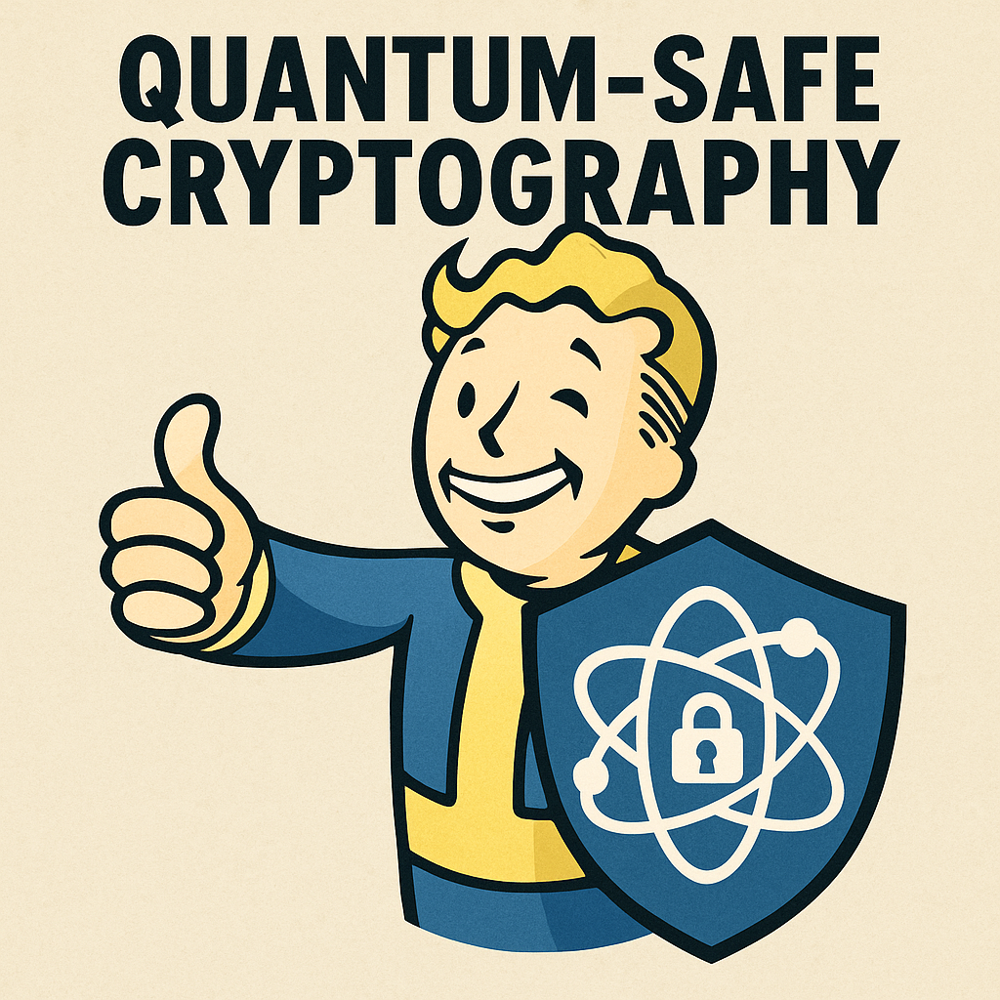

## Quantum-Safe Dev Environment Scripts

[]

This repository contains automation scripts for setting up a Docker-based OpenSSL 3 development environment with post-quantum cryptography (PQC) support, using the `openquantumsafe/oqs-ossl3` image.

Both Linux/macOS (**Bash**) and Windows (**PowerShell**) versions are provided. All scripts run a container that includes OpenSSL 3 with PQC algorithms, Apache HTTPD, and a hybrid post-quantum TLS endpoint.

## Script Overview

| Script | Platform | Purpose |
|--------|----------|---------|
| `bash/1.sh` | Linux / macOS | Build and run container |
| `bash/2.sh` | Linux / macOS | Same as above, but commented for learning |
| `bash/3.sh` | Linux / macOS | Cleanup: removes container, image, and volumes |
| `powershell/1.ps1` | Windows PowerShell | Build and run container |
| `powershell/2.ps1` | Windows PowerShell | Same as above, but commented for learning |
| `powershell/3.ps1` | Windows PowerShell | Cleanup: removes container, image, and volumes |

---

## What the Scripts Do

| Step | Description |
|------|-------------|
| 1 | Create a temporary build context and dynamically write a `Dockerfile` and build a Docker image containing OpenSSL 3, Apache, and PQC toolchains |
| 2 | Start container and serve a demo TLS site using a hybrid post-quantum certificate, auto-generate a Dilithium + ML-KEM certificate on first run, and test using curl over 4433. |
| 3 | Nuclear clean up |

---

## Architecture Support

These scripts require:

- **x86_64 (AMD64) CPU architecture**
- **64-bit operating system**
- **Docker Desktop or Docker Engine (Linux/macOS/Windows)**  
- Apple Silicon (ARM64) is *not supported* unless running the image under emulation (Rosetta/`--platform linux/amd64`)

---

## Requirements

### Linux / macOS
- Docker installed and running
- Bash (`/bin/bash`)

### Windows
- Docker Desktop (WSL2 backend recommended)
- PowerShell 7+ recommended (also works in Windows PowerShell 5.1)
- You may need to allow script execution:

#powershell

Set-ExecutionPolicy -Scope Process -ExecutionPolicy Bypass

## License

Copyright 2025 Robert Kuschel

| License    | Notes                                      |
| ---------- | ------------------------------------------ |
| Apache 2.0 |  [TLDR for Apache 2.0](https://www.tldrlegal.com/license/apache-license-2-0-apache-2-0)

---

## Maintainer
[Rob Kuschel — RobKuschel.com](https://RobKuschel.com)

```
